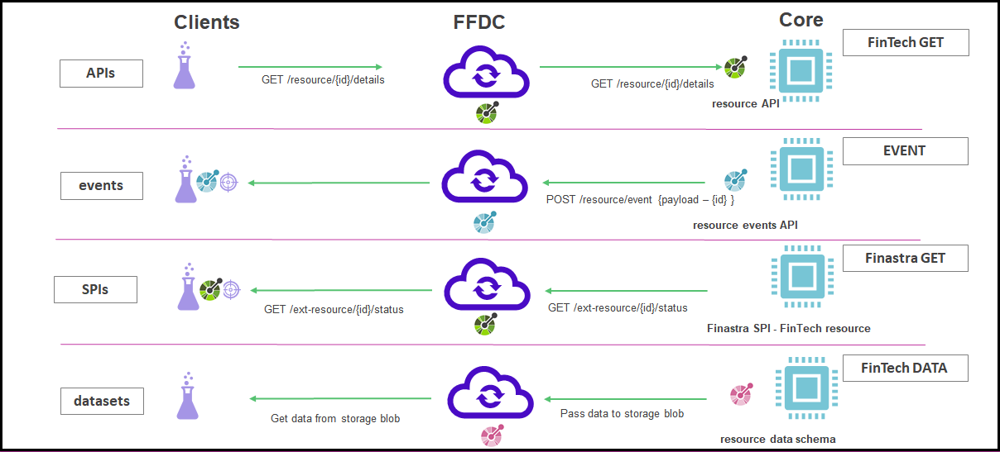

# Building Blocks

The following diagram shows the principal building blocks of Finastra integrations
that allow clients (FinTechs and Financial Institutions) consented access to systems managed and operated by 
tenants (Financial Institutions) of the FusionFabric.cloud platform:

The diagram includes the following components:

- **FFDC** - the FusionFabric.cloud platform exposes Finastra developed APIs so that clients can have access to APIs, SPIs, Events and Datasets whose data is provided by Financial Institutions connected to the FFDC platform.

- **Core** - these represent the Core backend systems connected to FusionFabric.cloud and providing implementations for APIs, Events and Datasets. These Cores are typically managed and hosted by Financial Institutions and they may be on-premise or cloud systems.

- **Clients** - these represent consumers of APIs, Events and Datasets. They are typically FinTechs who have been granted access by FusionFabric.cloud and Financial Institutions to APIs, Events and Datasets.

- **APIs** - these represent Finastra defined API contracts that clients can use to access resource data hosted by Financial Institutions. APIs are the principal focus of this document.

- **Events** - these represent Finastra defined business event contracts that clients can subscribe to. Events are generated by Financial Institutions to FFDC which then broadcasts messages to subscribers

- **SPIs** - these represent Finastra defined SPI contracts. SPIs allows the Financial Institution's systems to call services provided by clients e.g. to allow a payment system to call a 3rd Party fraud detection system - n this case the 3rd Party implements Finastra's SPI contract   

- **Datasets** - these represent Finastra defined dataset contracts that clients can use to obtain data extracted from Financial Institution's systems

