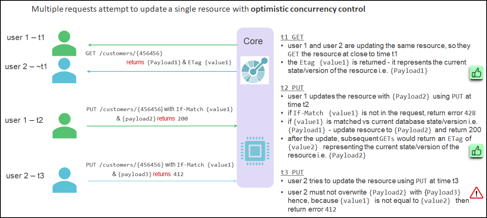

# Concurrency

Concurrency in the context of REST APIs refers to the simultaneous occurrence of multiple requests.

In systems that use optimistic locking, GET, POST and DELETE methods do not typically result in concurrency problems, however, data consistency problems can occur when updating resources using PUT or PATCH methods when appropriate concurrency designs are not implemented.

For example:

* two users have performed a GET against a resource e.g. GET /loans/123 and they both receive a payload of A (for instance amount = 10 EUR , Status= pending)
* the first user modifies the payload A (10 EUR) and requests an update with a new payload B e.g. PUT /loans/123 {B} updating the amount to 1 Millions 
* the second user modifies the payload A (10 EUR) and requests an update with a new payload changing the status to 'Approved'  e.g. PUT /loans/123 {C}
* because first user has already committed its changes, second user modifies the loan without being knowledgeable that a change has occurs and would approve a 1 million loan
* This is a concurrency scenario issue. Notice than concurrency does not need to be on same field. but on same resource. Notice also that the time elapsed does not matter.
* the solution to this problem  is to ensure that one of the user's is returned an error message stating that their update cannot be made

The following diagram provides an example of how concurrency problems are avoided using `If-Match` and `ETag`:




This scenario can be avoided when using optimistic locking by ensuring that update operations are designed to occur only when the original payload (payload A in the example) matches the resource's current payload. The implication of this approach in the example is that one of the users will be issued with an error message stating that the update cannot be made because the data has been modified from its state at the time of the GET by a separate unrelated update.

With REST APIs the solution is typically implemented using the following HTTP headers:

* `ETag` - this HTTP header field is a string that is returned when a GET is requested against a resource. The ETag contains a representation of the resource at the time the GET occurred and at its simplest, the ETag can be a version number or a timestamp (although this is best avoided in a distributed environment) but it is more likely to represent a hash of the resource's payload fields 

* `If-Match` - this HTTP header field is a string that is passed when a PUT is requested against a resource. The If-Match contains the ETag previously obtained from the GET request. The server will ensure that the PUT request is only performed if the value in the If-Match header matches the derived ETag value of the current state of the resource. If the update request cannot be performed due to a mismatch then a 412 HTTP status code must be returned. If the If-Match header is not in the PUT request then a 428 HTTP status code must be returned 

taking back the previous scenario
* two users have performed a GET against a resource e.g. GET /loans/123 and they both receive a payload of A (for instance amount = 10 EUR , Status= pending) ETag value = 1
* the first user modifies the payload A (10 EUR) and requests an update with a new payload B e.g. PUT /loans/123 {B} with ETag = 1 updating the amount to 1 Millions  , at backend side ETag moved to 2
* the second user modifies the payload A (10 EUR) , and requests an update with a new payload changing the status to 'Approved'  e.g. PUT /loans/123 {C} ETag = 1
* because first user has already committed its changes,The ETag value would not match , and so the approval would be declined. 
* to fix it, second user would need to retrieve back the modified version of the loan, wih the ETag value 2, and then apply changes given.

**Finastra API Standards:**

The implementation of concurrency using `ETag` and `If-Match` is not mandatory for all APIs since it imposes strict rules on the client and server, however, the implications of NOT implementing concurrency must be fully considered especially when backend servers support updates through a variety of different channels in addition to REST APIs, hence:

>  Concurrency **MUST** be considered for all API requests

>  Concurrency **SHOULD** be supported for PUT and PATCH requests

If concurrency is implemented then the following Finastra standards apply:

>  Finastra APIs supporting concurrency with optimistic locking **MUST** define `ETag` and `If-Match` headers on associated GET and PUT operations 

>  Finastra APIs supporting concurrency with optimistic locking **MUST** return 412 status code if the If-Match header on a PUT request does not match the derived ETag of the current state of the resource

>  Finastra APIs supporting concurrency with optimistic locking **MUST** return 428 status code if the If-Match header is not included on a PUT request


**Sample API Code:**

The following code snippets show sample OAS2 definitions of GET and PUT operations within a Finastra API that supports concurrency:

```{.notoggle .yaml}
 get:
...
   responses:
     200:
       schema:
         $ref: '#/definitions/test
       headers:
         ETag:
           description: Used to cache key for future requests
           type: string
```


```{.notoggle .yaml} 
 put:
   operationId: putEntry
   parameters:
   - name: If-Match
     in: header
     description: For updates this field needs to be present and contain an ETag value
     type: string
     required: true
...
   responses:
...
     412:
       description: Precondition Failed - version provided in the If-Match header is invalid
       schema:
         $ref: '#/definitions/ErrorDescription
     428:
       description: Precondition Required - version must be provided in the If-Match header
       schema:
         $ref: '#/definitions/ErrorDescription'
```

References:

* [MDN web docs: ETag](https://developer.mozilla.org/en-US/docs/Web/HTTP/Headers/ETag)
* [RFC 7232, section 2.3: ETag](http://tools.ietf.org/html/7232#section-2.3)
