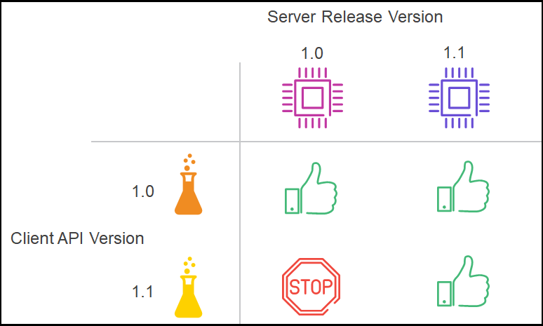

# Versioning
{: .no_toc}

Clients using Finastra APIs need to be aware of the impact of API changes in case they require client code changes, hence, this section provides details on the following topics:
- TOC
{:toc}

##  API Semantic Versioning

An API represents a contract between the provider of a service and the consumer of a service. This contract can evolve over the time and each publication of an API by a provider has an associated version.

Finastra APIs use the semver.org semantic version specification whereby the version of an API is represented by a major number, a minor number and a patch number.

The API semantic version is held in the `info: version` section of an OAS2 or OAS3 API contract.

For example, when a Finastra API has a version number of 1.2.7 the values 1, 2 and 7 have the following meanings:
-  ‘1’ represents a major version number
-  ‘2’ represents a minor version number
-  ‘7’ represents a patch version number

Finastra APIs increment the version numbers according to the following rules:
-  **Major** version – this version number changes when a new API version imposes a major contract change that requires action from the consumer to be compatible with the new API version. A major version number change typically involves breaking changes to the API contract
-  **Minor** version - this version number changes when a new API version imposes a contract change that does not require action from the consumer to be compatible with the new version
-  **Patch** version – this version number changes when an API change does not alter the API contract

Finastra APIs always define the *major* version in the URL path as per the following example which uses `v1`:
- https://api.fusionfabric.cloud/retail/v1/accounts

With this approach, version changes directly impact the consumer of the service. To call a different version the client has to call a different URL with a different embedded version as per the following example which uses `v2`:
- https://api.fusionfabric.cloud/retail/v2/accounts

The following example show how the versions might be used:

| Client URL        |  API Version  | Reason for API version change                                                                                             |
|-------------------|---------------|---------------------------------------------------------------------------------------------------------------------------|
|`/v1/accounts`     |  v1.0.0       | for the initial version                                                                                                   |
|`/v1/accounts`     |  v1.0.1       | is a minor change to modify documentation                                                                                 |
|`/v1/accounts`     |  v1.1.0       | is a minor change to add new functionality such as an optional field or new endpoints                                     |
|`**/v2/**accounts` |  v2.0.0       | is a major change such as the introduction of a breaking change - this modifies the url so must be published to the client|

The following standards apply within Finastra:

The following lists the Finastra standards for defining structures:

| Rule Identifier  | Description  |
|:-------:|:------------ |
| INF-011 | APIs **MUST** have a semantic version defined in their specification
| VER-001 | The major version of the API **MUST** be set in the path parameter as an `integer` prefixed with the letter `v` e.g. `https://{host}/v1/{resource}`
| VER-002 | API client versions against API endpoints **MUST** be incremented for breaking changes
| VER-003 | REST APIs in the industry use client versions that can be defined as query parameters, custom headers or accept headers with custom types. These different formats **MUST NOT** be used in Finastra

## API Backward Compatibility

Finastra's Open API compatibility policy is to ensure backward compatibility for client API calls.

Backward compatibility means that a Finastra API and its underlying server implementation will provide the same capabilities as previous versions of a Finastra API within the same major API version. 

For example, a client can be assured that when they adopt a Finastra Open API at a version that API’s capabilities will remain available without the need for the client to upgrade as subsequent versions of the API and/or server are released. 

The implication of this policy is that a Finastra APIs cannot be assumed to be compatible with all server versions. This is shown in the following diagram in which a Finastra server 1.0 has released an API at version 1.0 and then evolved to release API version 1.1 at server version 1.1.

The diagram shows:
- that a client which successfully adopted API version 1.0 against server version 1.0 will be supported as the server evolves i.e. the server continues to support the backward compatible API
- that a client adopting API version 1.1 cannot use API version 1.1 against server version 1.0; the client can only implement API version 1.1 against a server at version 1.1 and above

Note that backward compatibility does not apply to breaking changes to an API, for example, if the major version changes from 1 to 2 then version 2 of the API will not be compatible with version 1.

The remainder of this section details implications of the Finastra backward compatibility policy from the perspective of both servers and clients. 

### Policy Implications for Servers

The Finastra backward compatibility policy has the following implications for API providers in Finastra’s Lines of Business:

- servers providing APIs **MUST** be backward compatible so that client APIs implemented against earlier server versions are supported in later server versions 

- servers providing APIs **MAY** be forward compatible, however, this approach is not recommended

- servers **MUST** apply update operations using `PUT` so that fields that are not included in the request payload are not updated.

For example a server may support a payload of field A and optional field B but a client may only be aware of payload A. If a `PUT` operation with payload A (not B) is made against the server then only field A must be updated and field B must remain as is i.e the value is unchanged 

- servers **MUST** issue an HTTP 501 error if a client request an update (`POST` or `PUT`) for a field that it does not recognize in the payload 

### Policy Implications for Clients

The Finastra backward compatibility policy has the following implications for API consumers such as client Apps:

- clients **MUST** be fault tolerant when receiving responses. 

The expectation of clients is that a client calling a server API at
version 1.0.0 should be able to call the API at version 1.1.0 without
problems, for example, the same request payload should return 'at least'
the same response payload for all implementations of the API that have a major version of 1.

For example a server may support a payload of field A and optional field B (API version 1.1.0) and a client may only be aware 

- clients do **NOT** require knowledge of specific API versions e.g. they only know v1 not 1.2.1

- clients do **NOT** require knowledge of specific Server versions of each implementation

- API consumers **MUST** ensure they are aware of the implications for servers listed above

- API consumers **MUST** ensure they regularly review API announcements in the Community section of the Finastra Developer Portal for any APIs they use

- API consumers **MUST** not build an app on Deprecated API

## Maturity Levels

Finastra has four levels of maturity for APIs:

- **DRAFT** – An API is designated as Draft is a preview version on which feedback will be collected with Fintech collaboration. There is no implementation. It is very early stage. 
- **BETA** - an API designated as Beta is a preview including a core system first implementation. It allows fintech to have real feedback and behavior. Products can adjust their API as needed to answer to Fintech’s feedback. It is important to note that a Beta API will not be allowed in production with clients
- **GA** - an API designated as Generally Available (GA). This is an API designated as stable, therefore no breaking changes will be allowed
- **DEPRECATED** - an API designated as Deprecated is not longer recommended to be used. Before the API is deprecated, a notice period will be communicated on the Developer Portal in the community section. After the API is deprecated a removal notice period and an effective date will be communicated on the Developer Portal in the community section. After the removal period the API will be removed from the API Catalog and will no longer be available. 

The maturity level is defined in the API contract using a Finastra custom extension in the OAS info section named **`x-finastra-maturity-level`**. The maturity level is shown on the Finastra Developer Portal. 

Notes: 
- Finastra reserves the right to **make breaking changes to DRAFT and BETA APIs** e.g. field changes, end point changes, etc. This is done within a notice period that is communicated on the Developer Portal in the Community section. If applicable affected partners are also notified (see the API lifecycle section for further details)
- An API can be DRAFT and BETA are not mandatory Step
- GA and DEPRECATED
- DRAFT and BETA can be removed if no market is appearing.
- Once an API is DEPRECATED it will not be enhanced
- Client calls to removed APIs will return a `404` error

## API lifecycle 

The diagram below indicates the major lifecycle events of a Finastra Open API and shows:
- the progression of the API’s maturity levels: **DRAFT**, **BETA**, **GA**, **DEPRECATED** and **REMOVED**
- the introduction of breaking changes **MAY** be made to **DRAFT** and **BETA** APIs
- the introduction of breaking changes **MUST NOT** be made to **GA** APIs
- the introduction of breaking changes to a **GA** API at version 1.n.n **MUST** result in a new API version at version 2.0.0

Finastra will communicate lifecycle events to ensure that clients are aware of changes.

Deprecation and removal notice periods are determined by the API owner.

The following lists the Finastra standards that apply to the API lifecycle:

| Rule Identifier  | Description  |
|:-------:|:------------ |
| VER-010 | Finastra APIs **MUST** increment the minor and/or patch versions of the API whenever a change is made regardless of whether the change is breaking or non-breaking |
| VER-011 | Finastra APIs **MUST** be designed to be backwards compatible as far as possible |
| VER-012 | Finastra APIs **MUST** change the major version when breaking changes are introduced to the API |
| VER-013 | Finastra APIs **MUST NOT** be obsoleted when in use by customers; a published deprecation and obsoletion with appropriate notice periods must be provided |
| VER-014 | APIs **SHOULD** differentiate finished API definitions from work in progress - the maturity level of **DRAFT**, **BETA** and **GA** are used for this purpose |

## API Changes

This section details API changes that are considered to be non-breaking and breaking and it 
is included to inform clients which API changes are deemed to be compatible within a major API version changes and which API changes are deemed to be incompatible and require a change to the major version.

### Non-Breaking Changes

The following is a list of non-breaking changes that should result in a
backwardly compatible API:

| Id  | Change                                                 | Description                                                                                                                                                                                                             |                                            
|-----|--------------------------------------------------------|--------------------------------------------------------------------------------------------------------------------------------------------------------------------------------------------------------------|
|  1  | **Adding an endpoint or operation to an existing API** |Adding a new endpoint or a new operation e.g. `GET`) to an existing API is not a breaking change since clients would not need to modify their existing code to use the new version of the API.                  |
|  2  | **Extending the range of a request value**             |If a new optional parameter is introduced in any part of the 'query','path' or 'body', of a request, then the change is deemed to be a non-breaking change. If a new mandatory parameter with a default value is introduced then this would also be deemed a non-breaking change.|
|  3  | **Adding a field or header to a response**                       |The server assumes that the client is fault tolerant, hence, adding a new field or header to a response message is deemed to be a non-breaking change.|
|  4  | **Making a behavioral change**                                 |A behavioral change within the API is not necessarily considered a breaking change e.g. a 'rate limiting' error is not considered a breaking change because the client is assumed to be capable of handling any 4XX or 5XX errors.|

### Breaking Changes

The following is a list of breaking changes that would result in a backwardly incompatible API:

| Id  | Change                                                 | Description                                                                                                                                                                                                             |                                            
|-----|--------------------------------------------------------|--------------------------------------------------------------------------------------------------------------------------------------------------------------------------------------------------------------|
|  1  |**Removing or renaming a path, field, header or enum value**    |Client code that refers to API elements that have been renamed or removed can break on calling the API, therefore renaming or removing API elements **MUST** result in a major client version change.|
|  2  |**Adding, removing or renaming a response code**        |Client code that refers to response codes that have been renamed or removed can break on calling the API, therefore renaming or removing API elements **MUST** result in a major client version change. Similarly, client code that refers to 2XX response codes that have been added can break on calling the API, therefore adding a 2XX response code **MUST** result in a major client version change. Note that it is assumed that the client is capable of handling any 4XX or 5XX errors.|
|  3  |**Changing the type of a field**                        |When a field type is changed this can break the client code and client libraries and therefore **MUST** result in a major version change.|
|  4  |**Adding a required parameter**                              |Adding the keyword `required` to a parameter is considered a breaking change because clients may need to change their code to include the required parameter, therefore adding a required parameter **MUST** result in a major client version change.|
|  5  |**Changing the default value**                               |Changing the default value of a field is considered a breaking change because clients might may have made assumptions about a field's default value. For example, a client, who is using the initial version of an API, may create a new resource without explicitly setting the value of a field with a default value of 1. When the client uses a new version with the default value of a the field changed to 2 then when the client gets the resources they will receive a mix of 1 and 2 as the defaults. Therefore changing the default value of a field **MUST** result in a major client version change.|
|  6  |**Changing an operation**                               |Changing an API endpoint verbs from `PUT` to `PATCH`, or `POST` is considered as breaking change and therefore **MUST** result in a major version change. |
|  7  |**Adding or removing mime types for request or response content** |Changing the mime type of request or response content is considered as breaking change and therefore **MUST** result in a major version change e.g. replacing `application/json` with `application/xml` is a breaking change. |
|  8  |**Changing the type of a parameter**                        |When a parameter type is changed e.g. from `- in: path` to `- in: query` this can break the client code and client libraries and therefore **MUST** result in a major version change.|
|  9  |**Adding or removing additional properties for a field**                        |When the `additionalProperties` keyword is added to a field or removed from a field, this can break the client code and client libraries and therefore **MUST** result in a major version change.|
|  10  |**Strengthening a constraint for a request**                        |When a request field or parameter constraint is strengthened using keywords such as the following: `maximum`, `minimum`, `minLength`, `maxLength`, etc. this can break the client code and client libraries and therefore **MUST** result in a major version change. For example, if `maximumLength` is changed from `64` to `32` then the client may need to adjust their code to handle the changed constraint.|
|  11  |**Weakening a constraint for a response**                        |When a response field constraint is weakened using keywords such as the following: `maximum`, `minimum`, `minLength`, `maxLength`, etc. this can break the client code and client libraries and therefore **MUST** result in a major version change. For example, if `maximumLength` for a response field is changed from `64` to `128` then the client may need to adjust their code to handle the changed constraint.|
|  12  | **Adding or removing a value in an enum**                          |Enum is used for unchanging lists hence any change to the contents of an enum are considered a breaking change and therefore **MUST** result in a major version change.|
