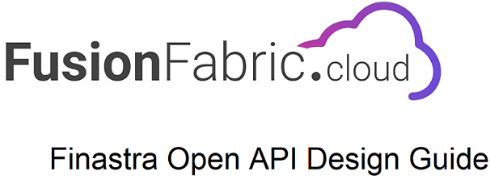

# Welcome

This document is the **Finastra Open API Design Guide** and the intended
audience are designers, developers, or consumer of Finastra Open APIs platform (https://developer.fusionfabric.cloud/ )  .

This document introduces the concepts of Finastra RESTful Open APIs and
details associated Open API development standards.

Finastra strategy is **API as a Product** and **API First** and these
approaches lead to successful implementation of a Finastra Open API
as a product.

**Document Conventions**

-   The key words “MUST”, “MUST NOT”, “REQUIRED”, “SHALL”, “SHALL NOT”,
    “SHOULD”, “SHOULD NOT”, “RECOMMENDED”, “MAY”, and “OPTIONAL” in
    Finastra standards are to be interpreted as described in [RFC
    2119](https://www.ietf.org/rfc/rfc2119.txt)

-   When a Finastra Open API standard is highlighted within the
    sections, the standard is shown in the following format:

> Finastra **SHOULD** follow this document however there is not legal guarantee.
